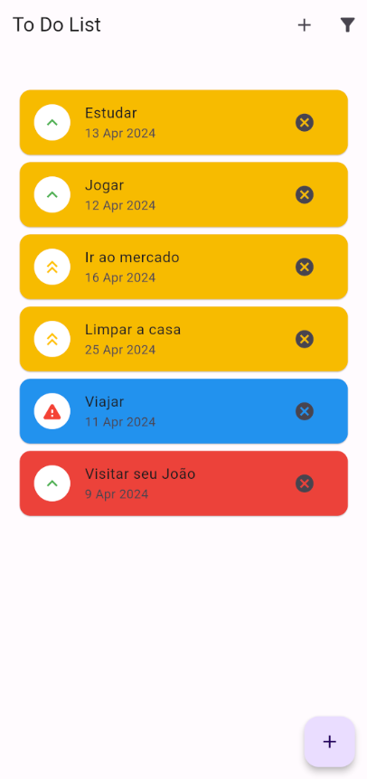
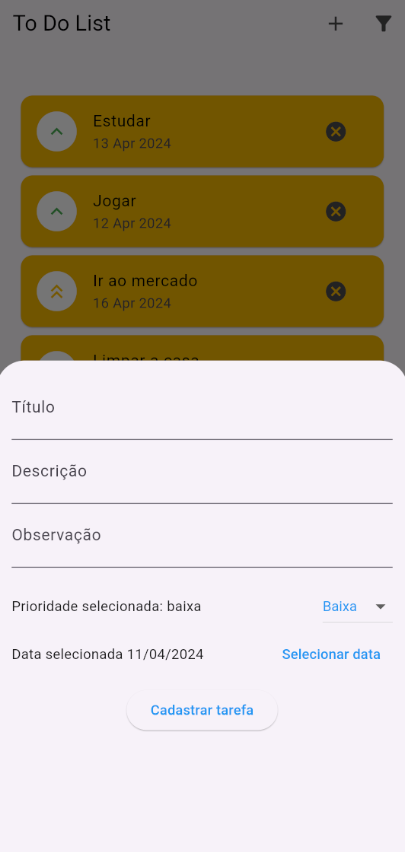
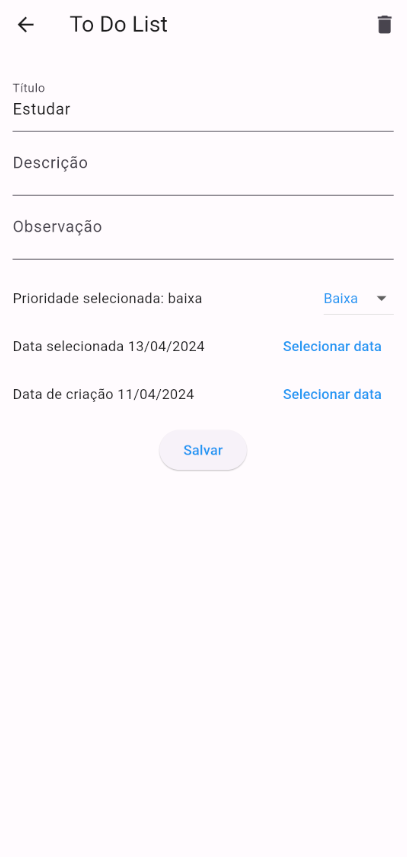

# TodoList

## Funcionalidades

- Crie, exclua e modifique tarefas com facilidade.
- Defina a prioridade de cada tarefa para manter o foco no que é mais importante.
- Adicione descrições detalhadas para cada tarefa para evitar mal-entendidos.
- Acompanhe a data de criação de cada tarefa para ter uma visão geral do seu progresso.
- Interface simples e intuitiva para facilitar o uso.

## Benefícios

- Aumente sua produtividade e eficiência.
- Alcance seus objetivos com mais facilidade.
- Tenha uma vida mais organizada e equilibrada.

## Ideal para

- Estudantes
- Profissionais
- Pais
- Qualquer pessoa que queira ser mais produtiva

## Instalação

> Requisitos:

- Flutter instalado e configurado.
- Um celular ou emulador de celular (como android studio)
  Instalando e rodando TodoList

```bash
  git clone https://github.com/BKluuis/TodoList.git
  cd TodoList
  flutter pub get
  flutter run
```

## Screenshots





